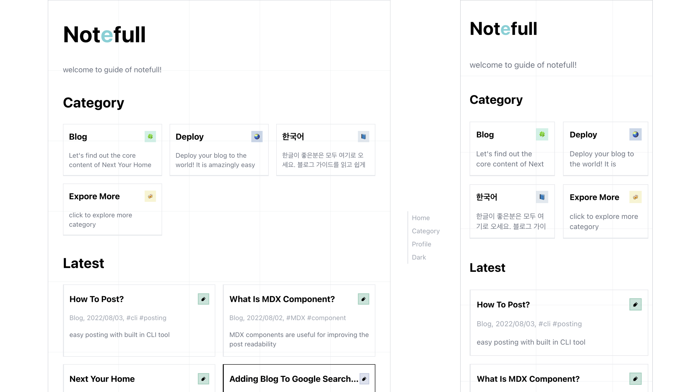

<div align="center">

# Notefull Theme 📔

> **`Note shape` | `Minimal` theme**


</div>

<br />

# Demo

> Visit [**Notefull Guide**](https://notefull-guide.vercel.app) built with this template



<br />

# Perfect Fit for

```ts
const FITS = {
    💁‍♂️: "Blog starters",
    💨: "Quick starters",
    🎨: "Love minimal",
    🍙: "Rich features",
    🚀: "Performance",
}
```

<br />

# How to start?

> 1.  👉 Click **`use this template`** to clone it in your `repo`
> 2.  👉 Visit [**Notefull Guide**](https://notefull-guide.vercel.app)

<br />

# Features

## Essential 📦

1. Change **Note background** to your **preferred design**
2. **MDX** full support with **[mdx-bundler](https://github.com/kentcdodds/mdx-bundler)**
3. **[CLI posting](https://github.com/danpacho/blog-post-generator)** support
4. **`SEO` optimized** with [next-seo](https://github.com/garmeeh/next-seo)
5. **`RSS`/`SITEMAP` generation** in `scripts`

## More 🚀

1. **First Load Js ⚡️ `54.3kb` ⚡️**, **preact** on production build
2. **Image optimized** with `next/image` and support **automatic-sizing**
3. **`Toc`** on desktop
4. **Google-analytics** full support in **[party-town-thread](https://github.com/BuilderIO/partytown#readme)**
5. **Code highlight** with [rehype-prism-plus](https://github.com/timlrx/rehype-prism-plus#readme), copy btn included
6. Scroll recovering
7. **Table of contents** in the desktop
8. **Math expression** _optional_ support with `katex`
9. Kind error message

<br />

# Effective post grouping 🍻

1. Category based grouping
2. Support series post

<br />

# LICENSE

[MIT](./LICENSE)
